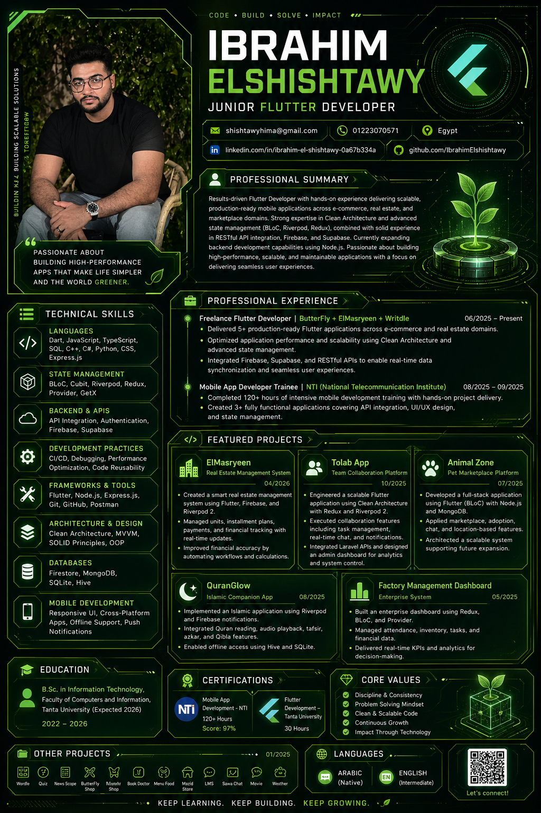

<table>
<tr>
<td valign="middle" width="75%">


<div align="center">

[](https://git.io/typing-svg)

<br/>

<a href="mailto:shishtawyhima@gmail.com">
  
</a>
&ensp;
<a href="https://www.linkedin.com/in/ibrahim-el-sheshtawy-0a67b334a">
  
</a>
&ensp;
<a href="https://wa.me/201223070571">
  
</a>

<br/><br/>


&ensp;

&ensp;

&ensp;


</div>

</td>
<td valign="middle" width="25%" align="center">




<br/>


</td>
</tr>
</table>

## &nbsp;👨‍💻 &nbsp;About Me

<table>
<tr>
<td valign="middle" width="54%">

```dart
class IbrahimElShishtawy extends FlutterDeveloper {

  final String name     = "Ibrahim El-Shishtawy";
  final String role     = "Advanced Flutter Developer";
  final String location = "Egypt  🇪🇬";
  final String edu      =
    "Computers & Information — Tanta University";

  final List<String> focus = [
    "Production-Grade Mobile Apps",
    "Clean Architecture  ·  SOLID",
    "CI/CD  ·  Automated Testing",
    "Smooth UI/UX  ·  Animations",
  ];

  final Map<String, List<String>> state = {
    "reactive"      : ["GetX", "MobX"],
    "unidirectional": ["Bloc", "Cubit", "Redux"],
    "declarative"   : ["Riverpod", "Provider"],
  };

  String get motto =>
    "Fast · Testable · Built to last.";

  bool get openToWork => true;
}
```

</td>
<td valign="middle" width="46%" align="center">



</td>
</tr>
</table>

---

## &nbsp;🚀 &nbsp;Flutter Expertise

<details>
<summary>&nbsp;<b>📱&nbsp; Flutter Core &amp; Architecture</b></summary>
<br/>

| Area | Details |
|------|---------|
| **Architecture** | Clean Architecture · MVVM · Feature-First Modular |
| **Layers** | Presentation → Domain → Data |
| **DI** | get_it · injectable · GetX bindings |
| **Navigation** | GoRouter · AutoRoute · GetX routing |
| **Code Quality** | SOLID · DRY · KISS · Design Patterns |
| **Async** | Future · Stream · Isolates · Compute |

</details>

<details>
<summary>&nbsp;<b>🧠&nbsp; State Management — All Patterns</b></summary>
<br/>

| Library | Pattern | Best For |
|---------|---------|----------|
| **GetX** | Reactive / Observer | Rapid dev, small-medium apps |
| **Bloc / Cubit** | Unidirectional / Event-State | Large apps, strict separation |
| **Riverpod** | Declarative / Provider 2.0 | Testable, compile-safe |
| **Provider** | InheritedWidget wrapper | Simple state |
| **Redux** | Unidirectional / Flux | Predictable global state |
| **MobX** | Reactive / Observable | Code-gen, reactive UI |

</details>

<details>
<summary>&nbsp;<b>🎨&nbsp; UI/UX &amp; Animations</b></summary>
<br/>

| Feature | Tools |
|---------|-------|
| **Responsive UI** | LayoutBuilder · MediaQuery · flutter_screenutil |
| **Implicit Animations** | AnimatedContainer · TweenAnimationBuilder |
| **Explicit Animations** | AnimationController · Tween · CurvedAnimation |
| **Custom Painters** | CustomPainter · Canvas API |
| **Lottie & Rive** | Complex design-tool animations |
| **Themes** | ThemeData · ColorScheme · Design Tokens |
| **Slivers** | SliverAppBar · CustomScrollView |

</details>

<details>
<summary>&nbsp;<b>🌐&nbsp; Networking &amp; Backend</b></summary>
<br/>

| Area | Details |
|------|---------|
| **HTTP** | Dio · http — interceptors, retry, error handling |
| **REST APIs** | CRUD · pagination · caching |
| **Firebase** | Auth · Firestore · Storage · FCM · Analytics |
| **Local Storage** | Hive · Isar · sqflite · SharedPreferences |
| **Serialization** | json_serializable · freezed · dart_mappable |

</details>

<details>
<summary>&nbsp;<b>🧪&nbsp; Testing Strategy</b></summary>
<br/>

| Type | Tools | Covers |
|------|-------|--------|
| **Unit** | flutter_test · mockito · mocktail | Business logic |
| **Widget** | flutter_test · finder APIs | UI components |
| **Integration** | integration_test | Full E2E flows |
| **Golden** | golden_toolkit | UI regression |

</details>

<details>
<summary>&nbsp;<b>⚙️&nbsp; CI/CD &amp; DevOps</b></summary>
<br/>

| Stage | Tools |
|-------|-------|
| **CI Pipeline** | GitHub Actions — lint · test · build |
| **Release** | Fastlane · versioning · changelogs |
| **Environments** | Flutter flavors — dev / staging / prod |
| **Distribution** | Firebase App Distribution · Play Console · TestFlight |

</details>

---

## &nbsp;🛠 &nbsp;Tech Stack

<div align="center">

**Core**&ensp;


<br/>

**State Management**&ensp;


<br/>

**Architecture**&ensp;


<br/>

**Backend & Storage**&ensp;


<br/>

**Testing**&ensp;


<br/>

**DevOps**&ensp;


<br/>

**Languages**&ensp;


</div>

---

## &nbsp;📊 &nbsp;GitHub Stats

<div align="center">


&ensp;


<br/><br/>


<br/><br/>


</div>

---

## &nbsp;📌 &nbsp;Featured Projects

<table>
<tr>
<td width="50%">
<h3 align="center">🏗&nbsp; Clean Architecture Template</h3>
<p align="center">
  <a href="https://github.com/ibrahimelshishtawy/REPO_NAME">
    
  </a>
</p>
<p align="center">
  
  
  
</p>
</td>
<td width="50%">
<h3 align="center">🧠&nbsp; State Management Showcase</h3>
<p align="center">
  <a href="https://github.com/ibrahimelshishtawy/REPO_NAME">
    
  </a>
</p>
<p align="center">
  
  
  
</p>
</td>
</tr>
<tr>
<td width="50%">
<h3 align="center">⚙️&nbsp; CI/CD + Testing Pipeline</h3>
<p align="center">
  <a href="https://github.com/ibrahimelshishtawy/REPO_NAME">
    
  </a>
</p>
<p align="center">
  
  
  
</p>
</td>
<td width="50%">
<h3 align="center">🎨&nbsp; UI &amp; Animations Pack</h3>
<p align="center">
  <a href="https://github.com/ibrahimelshishtawy/REPO_NAME">
    
  </a>
</p>
<p align="center">
  
  
  
</p>
</td>
</tr>
</table>

---

## &nbsp;🎓 &nbsp;Education

<div align="center">

| | |
|---|---|
| 🎓 &nbsp;**Tanta University** | Faculty of Computers & Information |
| 📚 &nbsp;**Major** | Computer Science & Information Technology |
| 🔬 &nbsp;**Focus** | Software Engineering · Mobile Development · Algorithms |

</div>

---

<div align="center">

<br/>

> *"Good architecture is not about being clever —*
> *it's about making the next developer's job obvious."*

<br/>

**Available for freelance &amp; collaborations**&ensp;·&ensp;
<a href="mailto:shishtawyhima@gmail.com">
  
</a>

<br/><br/>


</div>
